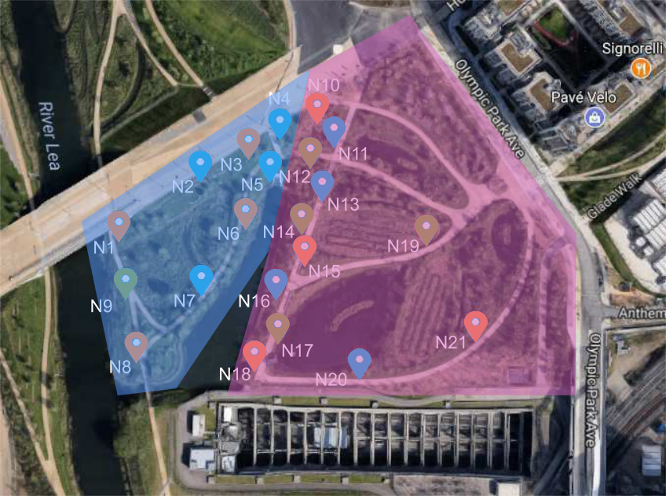

# LESSAlgorithm

This is an accompanying website for a paper submission to the EWSN'18 (https://ewsn2018.networks.imdea.org) conference. 

This project presents the LESS algorithm for promoting energy neutrality in energy harvesting Wireless Sensor Networks (WSNs) delivering services to multiple users. LESS is a lightweight distributed algorithm designed to achieve synergy between applications requirements and Energy-Neutral Operation (ENO) leading to energy-neutral operation of sensors. The approach provides an orchestration framework allowing users to specify application requirements, which are disseminated to sensors to indicate the frequency of sensing and data transmission required by applications. Sensors use the provided specification to determine the duty cycle needed to satisfy the requirements of applications, while still conforming to the constraints of ENO.

A prototype version of LESS is currently available along with a simulator, which allows to evaluate the algorithm for solar, wind and thermal energy sources.

## Basic Features

* **Orchestrator** component, which allows users to specify requirements pertaining to the application whilst being agnostic to the operation of the ENO algorithm itself. These requirements are normalized by the orchestrator and disseminated into the network.

* **Low Energy Sensor Scheduling (LESS)** algorithm that has been developed to promote synergy between the requirements of applications and the energy constraints of ENO WSNs whilst maintaining fairness when provisioning tasks.

 

    
    <h5 id="title" align="center">The orchestration framework scheme.</h5>
 

## Requirements
* Python 2.7.x
* numpy (1.13.1)
* pandas (0.20.3)
* simplejson (3.11.1)

## Simulation 

    
    <h5 id="title" align="center">WSN layout of the urban park deployment.
        The blue area indicates the RIVERSIDE location. The purple area indicates the AVENUE location.
        Pins indicate sensor assignment to applications: blue(App1), orange(App2), green(App3)</h5>
 
