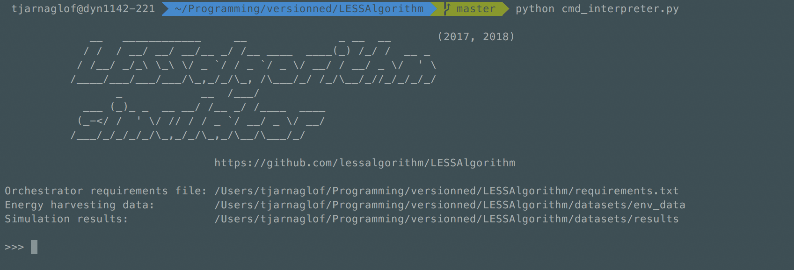
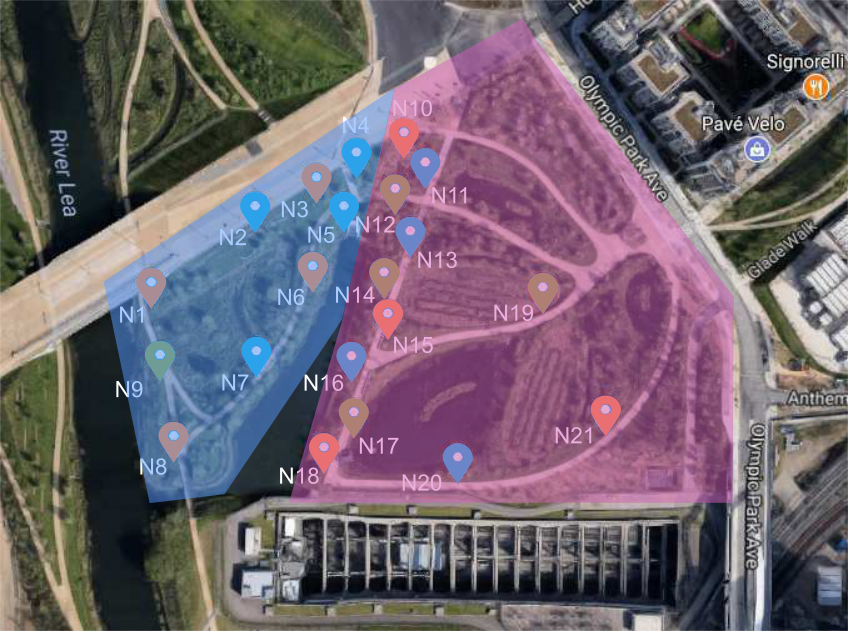
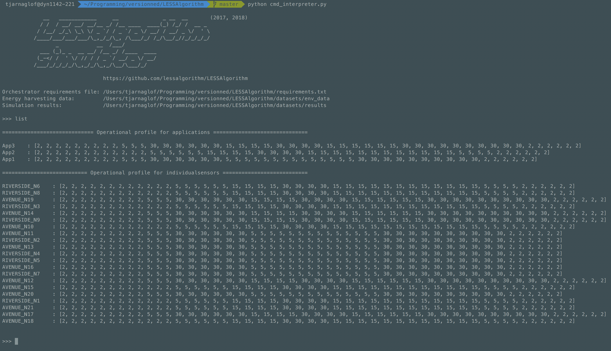
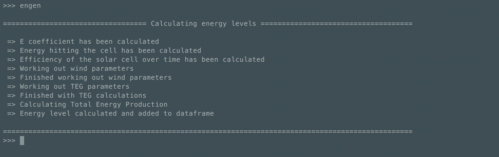
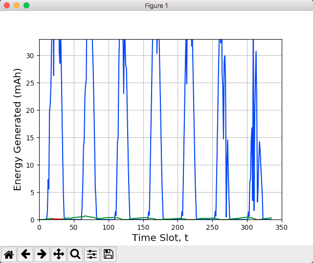
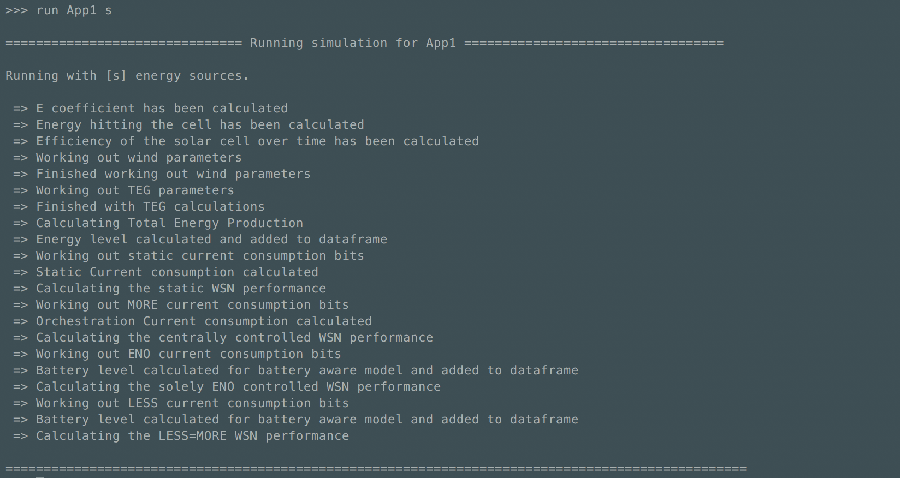
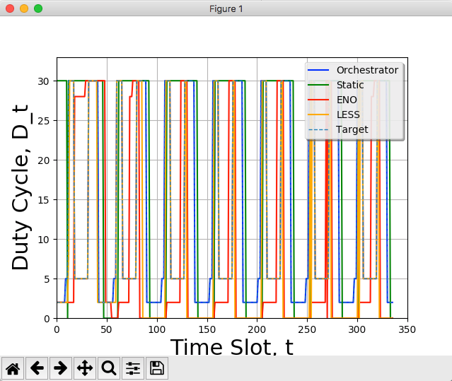
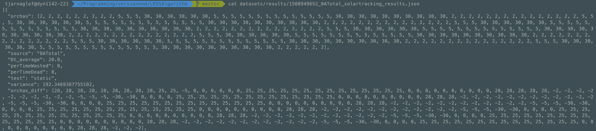

# LESSAlgorithm

This is an accompanying website for a paper submission to the EWSN'18 (https://ewsn2018.networks.imdea.org) conference. 

This project presents the LESS algorithm for promoting energy neutrality in energy harvesting Wireless Sensor Networks (WSNs) delivering services to multiple users. LESS is a lightweight distributed algorithm designed to achieve synergy between applications requirements and Energy-Neutral Operation (ENO) leading to energy-neutral operation of sensors. The approach provides an orchestration framework allowing users to specify application requirements, which are disseminated to sensors to indicate the frequency of sensing and data transmission required by applications. Sensors use the provided specification to determine the duty cycle needed to satisfy the requirements of applications, while still conforming to the constraints of ENO.

A prototype version of LESS is currently available along with a simulator, which allows to evaluate the algorithm for solar, wind and thermal energy sources.

## Basic Features

* **Orchestrator** component, which allows users to specify requirements pertaining to the application whilst being agnostic to the operation of the ENO algorithm itself. These requirements are normalized by the orchestrator and disseminated into the network.

* **Low Energy Sensor Scheduling (LESS)** algorithm that has been developed to promote synergy between the requirements of applications and the energy constraints of ENO WSNs whilst maintaining fairness when provisioning tasks.

<br />
<p align="center">
    
    <h5 id="title" align="center">The orchestration framework scheme.</h5>
</br>

## Requirements
* Python 2.7.x
* numpy (1.13.1)
* pandas (0.20.3)
* simplejson (3.11.1)

```bash
sudo apt-get install python-pip
sudo pip install numpy
sudo pip install pandas
sudo pip install simplejson
```

## Simulation 

#### Start the simulator ####
```bash
python cmd_interpreter.py
```
<p align="center">
    
    <h5 id="title" align="center">Start the simulator.</h5>
</br>

#### Read application requirements ####

Application requirements are stored in the ```requirements.txt``` file.

```
# This dataset defines application requirements for use cases presented in the
# EWSN submission. The park is divided in two main areas, i.e., riverside and
# avenue. The WSN layout is provided in the park_wsn_layout.png file.

@App1=[9:00pm-4:30am->2, 4:30am-6:00am->5, 6:00am-9:00am->30, 9:00am-4:00pm->5, 4:00pm-9:00pm->30]
@App2=[9:00pm-6:00am->2, 6:00am-9:00am->5, 9:00am-11:00am->15, 11:00am-1:00pm->30, 1:00pm-7:00pm->15, 7:00pm-9:00pm->5]
@App3=[9:00pm-4:30am->2, 4:30am-6:00am->5, 6:00am-9:00am->30, 9:00am-11:00am->15, 11:00am-1:00pm->30, 1:00pm-4:00pm->15, 4:00pm-9:00pm->30]

# <time, location, frequency>
# App1 requirements (smart lighting system)
<9:00pm-4:30am, RIVERSIDE_N2, 2>
<9:00pm-4:30am, RIVERSIDE_N4, 2>
<9:00pm-4:30am, RIVERSIDE_N5, 2>
<9:00pm-4:30am, RIVERSIDE_N7, 2>
<9:00pm-4:30am, AVENUE_N11, 2>
<9:00pm-4:30am, AVENUE_N13, 2>
<9:00pm-4:30am, AVENUE_N16, 2>
<9:00pm-4:30am, AVENUE_N20, 2>
...
```

These requirements are defined for application scenarios described in the paper submission. The layout of the WSN in the urban park is as depicted below.

<p align="center">
    
    <h5 id="title" align="center">WSN layout of the urban park deployment.
        The blue area indicates the RIVERSIDE location. The purple area indicates the AVENUE location.
        Pins indicate sensor assignment to applications: blue(App1), orange(App2), green(App3)</h5>
</br>

The orchestration profile for each application and sensor node is produced using the list command.

```bash
>>> list
```

<p align="center">
    
    <h5 id="title" align="center">List the orchestration profile of applications and sensors.</h5>
</br>

#### Generate energy harvesting prediction ####

To generate the prediction for energy harvesting by sensors using solar, wind and thermal use the ```engen``` command. Environmental data used for generating energy harvesting prediction can be found in ```datasets/env_data/0ATotal_solarcalc_raw.csv```.

```bash
>>> engen
```

<p align="center">
    
    <h5 id="title" align="center">Engen command output.</h5>
</br>

<p align="center">
    
    <h5 id="title" align="center">Graph presenting the energy generated using various energy harversting methods: 
        solar(blue), wind(green), thermal(red).</h5>
</br>

#### Simulating algorithms ####

To run a simulation using provided application requirements and the defined energy harvesting model use the ```run``` command.
The command takes two arguments: 1. application identifier (e.g., App1), 2. energy harvesting sources (s -> solar, w -> wind, t -> thermal). Solar is the default harvesting source.

```bash
>>> run App1 s
```

<p align="center">
    
    <h5 id="title" align="center">Run command output.</h5>
</br>

<p align="center">
    
    <h5 id="title" align="center">Graph presenting the operation of different algorithms for App1 over time. </h5>
</br>

Simulation results are stored in the JSON format and can be found in the ```datasets/results``` folder. 

<p align="center">
    
    <h5 id="title" align="center">Results presented in the JSON format.</h5>
</br>

The results presented in the EWSN paper submission can be found in the ```ewsn_results``` folder. 

## Algorithm design

The operations provided by the LESS algorithm are described below

#### findDuty #### 
The ```findDuty``` operation calculates a the duty cycle of a sensor for each time slot at the beginning of each time window. The code for findDuty can be found in less_simulator.py file where the initial seeding is provided in lines 500 - 509.

From the initial seeding the duty cycle required for each timeslot is calculated from the predicted energy for the new time window Nw. Then, during the operation of ```performDuty```, the energy generation predicted is used to define the number of sensing, computation and transmission tasks possible for the upcoming timeslot. After these tasks have been completed the real energy generated is then calculated in ```checkHg```. The difference between the predicted energy generation and real energy generation then determines if there is residual energy in the system and the upcoming scheduled tasks in future timeslots in the current time window are dynamically updated to account for differences between prediction and reality to ensure sustainability. 


#### performDuty #### 
The ```performDuty``` function, in the lessWSN function at 529 to 564 in less_simulator.py works out energy from performing the tasks scheduled in the current timeslot as per the energy model described in the associated EWSN paper. This information is provided to the dynamic scheduling element of the algorithm described in ```findDuty```. 

#### checkHg #### 
In the lessWSN function, at lines 579-615 of less_simulator.py, the ```checkHg``` function is performed. 

As this is a simulator, careful consideration has been undertaken to represent the real world dynamics and prediction of solar. The EWMA prediction method for solar is used over a time window, Nw, but at the end of a time slot the real energy generated is known in a WSN. This knowledge is simply gained by measuring energy generated (once or at set intervals throughout the timeslot via a high side current sensor, depending on timeslot length). 

For the simulation, ```checkHg``` here uses the real data for said timeslot (known from NREL database) and compares this to the predicted data from the EWMA method.  The algorithm goes on to use this to understand if the system over or under provisioned the network tasks in a timeslot when compared to the predicted amount. This is how the residual energy metric is calculated to reassign energy dynamically for future timeslots in the same time window .

The actual energy generated is calculated in the functions ```panelEnergyGen```, for solar, ```NRELtoWindPower```, for wind, and ```NRELtoTEGPower``` for theroelectric generators. 

#### surplusTask #### 
The ```surplusTask``` function in the lessWSN function of less_simulator.py at lines 542-548 flags state where surplus energy is generated. 

If orchestrator needs have been met for the time window and the energy storage element is full, the remaining energy can be used to perform system and maintenance tasks. For the purpose of this paper we keep the notion of surplus tasks abstract, however this will inform future work. However, it is important to note that the dynamic d_t^max of this paper will promote a greater energy surplus in comparion to the ENO-Kansal method which in turn will allow for a greater number of surplus tasks to be performed, highlighting a benefit of our work. 

#### ewmaUpdate #### 
In the ```ewmaUpdate``` function in the lessWSN function of the less_simulator.py script at the end of each time slot in the master loop the EWMA is updated for that timeslot, weighted against historical values, calculated in lines 529-564 and updated at line 566. 

Uses recorded data from current sensor, or historical real trace data in the case of the simulator, to update energy generation array for future time window as per prescribed EWMA function. This then informs the potential for energy generation in the next time window. 
